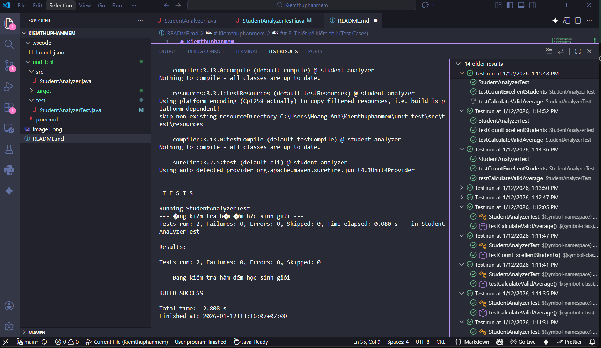
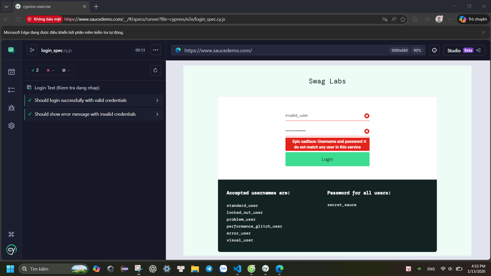
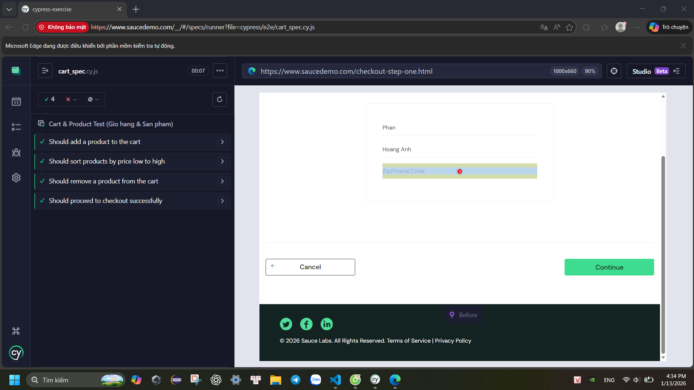

# BÁO CÁO MÔN HỌC: KIỂM THỬ PHẦN MỀM

**Thông tin sinh viên:**
- **Họ và tên:** Phan Hoàng Anh
- **Mã sinh viên:** BCS23016
- **Môn học:** Kiểm thử phần mềm

---

# CHƯƠNG 1: BÀI TẬP TUẦN 1 (05/01/2026)

Kết quả thực hiện bài tập:


---

# CHƯƠNG 2: KIỂM THỬ ĐƠN VỊ VỚI JUNIT (10/01/2026)

## 1. Thông tin chung
- **Yêu cầu:** Viết Unit Test cho chương trình phân tích điểm học sinh.
- **Công cụ thực hiện:** VS Code, Java, Maven, JUnit 4.13.2.

## 2. Cấu trúc dự án
```text
unit-test/
├── src/
│   └── StudentAnalyzer.java      # Mã nguồn chính (Chức năng)
├── test/
│   └── StudentAnalyzerTest.java  # Mã nguồn kiểm thử (Test Cases)
├── pom.xml                       # Cấu hình thư viện Maven
└── README.md                     # File báo cáo này
```

## 3. Mô tả bài toán
Xây dựng lớp `StudentAnalyzer` để phân tích điểm số học sinh với yêu cầu xử lý dữ liệu chặt chẽ (Validate dữ liệu đầu vào).

### Các chức năng đã cài đặt:
1. **`countExcellentStudents(List<Double> scores)`**
   - **Mục tiêu:** Đếm số lượng học sinh đạt loại Giỏi (Điểm >= 8.0).
   - **Logic xử lý:** Duyệt qua danh sách, tự động bỏ qua các điểm số không hợp lệ (nhỏ hơn 0 hoặc lớn hơn 10).

2. **`calculateValidAverage(List<Double> scores)`**
   - **Mục tiêu:** Tính điểm trung bình cộng của cả lớp.
   - **Logic xử lý:** Chỉ cộng tổng các điểm hợp lệ (0-10). Trả về `0.0` nếu danh sách rỗng để tránh lỗi chia cho 0.

## 4. Thiết kế kiểm thử (Test Cases)
Sử dụng **JUnit 4** để viết các kịch bản kiểm thử tự động trong file `StudentAnalyzerTest.java`:

| ID | Kịch bản (Scenario) | Dữ liệu đầu vào (Input) | Mong đợi (Expected) | Ghi chú |
|----|---------------------|-------------------------|---------------------|---------|
| #1 | **Dữ liệu hỗn hợp** | `9.0, 8.5, 7.0, -1.0` | Đếm giỏi: `2` | Bỏ qua điểm lỗi -1.0 |
| #2 | **Danh sách rỗng** | `Empty List` | Trả về `0` | Kiểm tra độ ổn định |
| #3 | **Dữ liệu biên** | `8.0` | Đếm giỏi: `1` | Kiểm tra toán tử >= |
| #4 | **Tính trung bình** | `9.0, 8.5, 7.0` | Kết quả: `~8.167` | Sai số cho phép 0.01 |

## 5. Hướng dẫn chạy (How to run)
1. Mở thư mục dự án bằng **VS Code**.
2. Đợi Maven tải thư viện JUnit (trong file `pom.xml`).
3. Mở file `test/StudentAnalyzerTest.java`.
4. Nhấn nút **Play (▶)** màu xanh bên cạnh tên Class hoặc tên hàm để chạy test.

## 6. Kết quả thực hiện
Code đã vượt qua tất cả các bài kiểm thử (All Tests Passed).



---

# CHƯƠNG 3: BÀI TẬP TUẦN 3 (13/01/2026)

## 1. Thông tin chung
**Yêu cầu:** Kiểm thử End-to-End (E2E) trang web thương mại điện tử mẫu (SauceDemo).

**Công cụ thực hiện:** Node.js, Cypress.

**Trang web kiểm thử:** https://www.saucedemo.com

## 2. Cấu trúc dự án
```text
cypress-exercise/
├── cypress/
│   └── e2e/
│       ├── login_spec.cy.js      # Kịch bản kiểm tra Đăng nhập
│       └── cart_spec.cy.js       # Kịch bản kiểm tra Giỏ hàng & Thanh toán
├── package.json                  # Cấu hình dự án Node.js
└── cypress.config.js             # Cấu hình Cypress
```
## 3. Kịch bản kiểm thử (Test Cases)
Đã thực hiện các kịch bản kiểm thử tự động mô phỏng hành vi người dùng thật:

| File Test | Kịch bản (Test Case) | Mô tả chi tiết | Trạng thái |
|-----------|----------------------|----------------|------------|
| **Login** | Đăng nhập thành công | Nhập đúng user/pass (`standard_user`) -> Vào trang Inventory. | ✅ Passed |
| **Login** | Đăng nhập thất bại | Nhập sai user/pass -> Hệ thống hiển thị thông báo lỗi. | ✅ Passed |
| **Cart** | Thêm vào giỏ hàng | Click "Add to cart" -> Badge giỏ hàng hiện số 1. | ✅ Passed |
| **Cart** | Lọc sản phẩm | Chọn "Price (low to high)" -> Sản phẩm giá thấp nhất lên đầu. | ✅ Passed |
| **Cart** | Xóa khỏi giỏ hàng | Click "Remove" -> Badge giỏ hàng biến mất (Bài tập thêm). | ✅ Passed |
| **Cart** | Quy trình Checkout | Giỏ hàng -> Checkout -> Điền Info -> Continue -> Overview (Bài tập thêm). | ✅ Passed |

## 4. Hướng dẫn chạy (How to run)
1. Mở terminal tại thư mục `cypress-exercise`.
2. Cài đặt thư viện (nếu chưa có): `npm install`.
3. Chạy trình kiểm thử: `npx cypress open`.
4. Chọn **E2E Testing** -> **Chrome** -> Chọn file spec muốn chạy (`login_spec` hoặc `cart_spec`).

## 5. Kết quả thực hiện
Toàn bộ kịch bản kiểm thử đều chạy thành công trên trình duyệt Chrome.

**Kết quả 1: Kiểm thử chức năng Đăng nhập (Login Spec)**


**Kết quả 2: Kiểm thử Giỏ hàng & Thanh toán (Cart Spec)**



